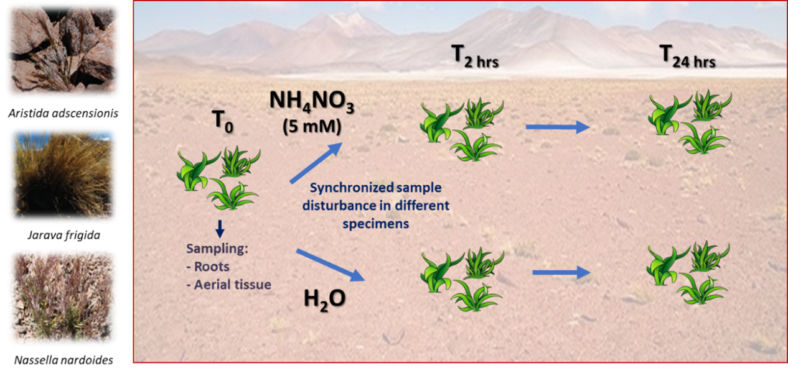
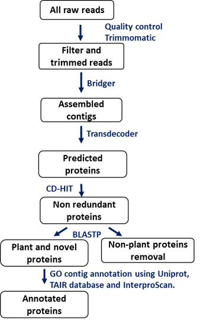
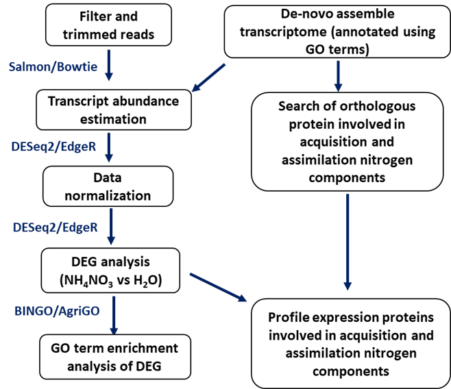
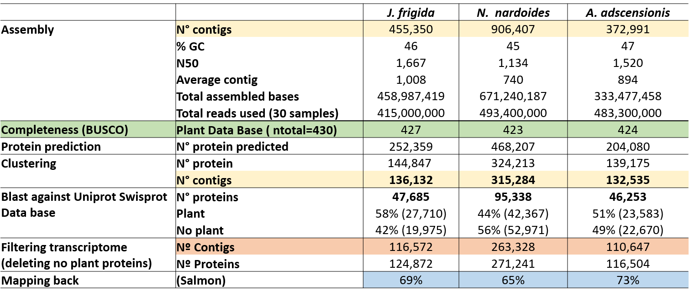

```{r setup, include=FALSE, cache=F}
knitr::opts_chunk$set(echo = F, warning = F, message = F)
#if (!requireNamespace("BiocManager", quietly = TRUE))
    #install.packages("BiocManager")
#BiocManager::install("DESeq2")
#BiocManager::install("tximport")
library("rmarkdown")
library(scales)
library("DESeq2")
library("tximport")
library("tidyverse")
library(dplyr)
library("ggplot2")
library(reshape)
library(grid)
library(gridExtra)
library(lattice)
library(kableExtra)
library(knitr)
library(scales)
library(pacman)
library("pheatmap")
library("gridExtra")
```

## Introduction
 <div class=text-justify> <p>
The Atacama Desert is the most arid non-polar environment on earth. It is also one of the oldest deserts on Earth, under arid conditions during the last 33 million years and hyperarid conditions for the last twelve million years. Drought, high radiation levels, poor soils, among other adverse environmental conditions, challenge the survival of plant species  [@diaz2019multiscale]. Despite these inhospitable conditions, some plant species have adapted to survive in the boundaries of the absolute desert, with a high number of endemic and native species.

In the western slope of the Andes in the Atacama Desert, a climate gradient is generated, with a strong altitude influence over the precipitation. Our group has studied the plant's species that live in the Talabre-Lejia Transect (2400-4500 meters above sea level [MASL]) for ten years [@diaz2019multiscale]. The study of the soluble soil composition in this area indicates an extremally low concentration of nitrogen components. Nitrogen is a vital element for life, forming part of proteins and nucleic acid.  How plants species have adapted to live with low concentrations of nitrogen components, still is not understanding. 
Traditional laboratory-based genetic studies ignore the ecological context in which the organism evolved and only reveals a limited portion of the organism´s environmentally-modulated genetic repertoire.  In order to gain insight into how plants respond to fluctuations in external N sources, and to consider the ecological context in which these plant species evolved, we analysis the transcriptomic profile of three *Poaceae* species, after a disturbing in-situ treatment with NH~4~NO~3~. These three grass species are found in different altitude in TLT: *Aristida Adscensionis* (2700-3500 MASL), *Jarava frigida* (3700-4500 MASL), and *Nassella nardoides* (4300-4500 MASL). 

The study the profile expression of the orthologous protein involved in acquisition and assimilation nitrogen components and an DEG analysis, it will allows to understand how the plants respond to fluctuations in external N sources, and to propose insights about how plants species have adapted to live with low concentrations of nitrogen components, considering the ecological context in which these plant species evolved.
 </p>

## Material and Methods
### *In-situ* experiment and sampling 
Due to *Aristida Adscensionis*, *Jarava frigida*, and *Nassella nardoides* live in different altitudes in the TLT, we selected 30 plants specimens of in the TLT before the treatment, in order to stimulate \@ref(fig:Exp) specimens synchronically at the same time \@ref(fig:Exp).  We sampled both root and shoot tissue before the treatment in triplicate (samples indicate as T0). The treatments were done with a solution 5mM of NH~4~NO~3~ and water. After 2 (T2) and 24 (T24) hours of the stimulus with NH~4~NO~3~ and water, we took three root samples and three shoot samples from different plants (i.e., six different plant specimens were necessary for each condition, to take three shoot samples and three root samples). Samples were stored after being snap-frozen in liquid nitrogen immediately after collection in the field. Frozen samples were transported in dry ice to the laboratory for RNA extraction.

```{r,Exp, fig.cap="**Fig Nº1. *In-situ* experimental strategy**. T0 = watering time, T2hrs = 2 hours after the watering, T24hrs = 24 hours after the watering.", out.width="1000px", echo=F, fig.align="center"}


```
 
###  Library construction and sequencing
RNA was extracted from the plant tissues with the PureLink RNA Mini Kit (Ambion, 12183-018A). To remove contaminating secondary metabolites such as polysaccharides and polyphenolics, Plant RNA Isolation Aid (Ambion, AM9690) was used. DNase treatment of RNA samples was done with the DNA-free kit (Ambion, AM1906). RNA quality was checked by a NanoDrop 2000 spectrophotometer (Thermo Scientific), and by a Fragment Analyzer capillary electrophoresis instrument (Advanced Analytical Technologies, Cat DNF-471), according to the manufacturer’s instructions. Samples with an RNA Quality Number (RQN) of eight or more were used for library construction.

Library constructions were performed using the TruSeq RNA Library Prep Kit (Illumina), using 0.5 µg of total RNA, following the manufacturer’s instructions. Library quantitation was performed by qPCR with the Library Quant Kit Illumina GA (KAPA, Cat KK4824). Library size range was determined with the High Sensitivity NGS Kit on the Fragment Analyzer (Advanced Analytical Technologies, Cat DNF-474). The libraries were clustered on-board and sequenced with Illumina HiSeq2500 instrument, in order to generate 125b paired-end reads (Illumina, Cat PE-402-4002, FC-402-4021 and FC-402-4022).  

### De-novo assembly and protein annotation
In a previous work with transcriptomic data (Undurraga et al., unpublish), we developed a de-novo assembly pipeline \@ref(fig:pipeline), and we assembled de-novo transcriptomes from 32 plant species from the Atacama Desert, including *Aristida Adscensionis*, *Jarava frigida* and *Nassella nardoides* transcriptomes. However, data obtained from the experiment explained in \@ref(fig:Exp), indicate the presence of transcriptomic data no included in the transcriptome assembled previously (the mapping back percentages of the reads obtained from the experiment shown in \@ref(fig:Exp) were lower than 25% per sample). To incorporate the new transcriptomic data, we de-novo assembled a transcriptome of each three grass species. 

Briefly, we tested the quality of the reads using FastQC-v0.11.5 and MultiQC-v1.7 software, using default parameters. We eliminated lower quality and adaptor sequence with Trimmomatic-v0.39 ([@bolger2014trimmomatic]) using the following parameters: LEADING=20, TRAILING=20; SLIDINGWINDOW=10:30; MINLEN=50; ACGQUAL=25; ILLUMINACLIP: TruSeq3-PE. After this process, we retested the quality of surviving sequences with FastQC-v0.11.5 and MultiQC-v1. 7software. We assemble de-novo the transcriptome of *Aristida adscensionis*, *Jarava frigida*, and *Nassella nardoides* using 30 samples per species with Bridger assembler (v.2014-12-01) using min_kmer_coverage= 5 and pair-end sequence. The completeness of the transcriptome was evaluated using BUSCO ([bolger2014trimmomatic]). With Transdecoder-v 5.5.0 (Hass et al., 2013), we predict the protein sequences from the contigs assembled, and we eliminate the protein redundancy using CD-HIT-v4.7 ([@fu2012cd]) using as criteria of 90% identity as clustering threshold.

To annotate the clustered protein, we used the Uniprot and TAIR databases to obtain the protein description by homology search using BLASTX, with a cut-off for the e-value < 1e-10. Additionally, we used GO terms to annotate functionally the transcriptomes obtained using InterProScan-v5.35 ([@jones2014interproscan]) software, and Uniprot and TAIR databases. 
 
```{r,pipeline, fig.cap="**Fig. 2. Pipeline used to *de-novo assembly* **", out.width="400px", echo=F, fig.align="center"}


```
### Estimation transcript abundance, differential expression analysis and functional enrichment analysis using GO terms
We carried out the mapping back to the transcriptome and an estimation of the transcript abundance in each condition and tissue for each species using Salmon-v0.13.1 ([@patro2017salmon]) using a bootstrap=30 and default parameters The differential expression genes analysis (DEG) was performed with the package ‘DESeq2’([@love2014moderated]) in R-v3.52 environment. We tested different approaches to data normalization. Finally, we extract a list of contig differentially expressed with a Log2 fold change >=2 and Q-value >=0,01. Using plugging BINGO  of Cytoscape and AgriGO platform (ref), we determinate the functional enrichment of the contig differentially expressed at 2 and 24 hours after the stimuli with NH~4~NO~3~.
 
```{r, pipeline_DEG, fig.cap="**Fig Nº3. Pipeline used to differential expression analysis.**", out.width="600px", echo=F, fig.align="center"}


```

## Results and Discusion

The statistical data, completeness, mapping back, and annotation data obtained from the transcriptomes obtained are shown in Table \@ref(fig:Tablaensambles)

*N. nardoides* de-novo transcriptome obtained doubling the contig content of *J. frigida* and *A. adscensionis* transcriptome. Mean percentage of read mapped back to the clustered transcriptomes was of 69% to *J. frigida*, 65% to *N. nardoides* and 73% to *A. adscensionis*.  The annotation with Gen Ontology terms using Uniprot Swissport database, TAIR data base and InterproScan software was of 58% to *J. frigida*, 53% to *N. nardoides* and 59% to *A. adscensionis*.  

```{r,Tablaensambles, fig.cap="Summary of assembled transcriptomes of the tree grasses species", out.width="800px", echo=F, fig.align="center"}


```


```{r, Metadata_DEG_Aads}

###Metadata

samples<- read.delim2("samples.txt", header=T)
### Aads
Aads<- as.data.frame(samples[61:90,]) %>% 
  mutate(samples=samples[61:90,]) %>% 
  select(samples) %>% mutate(condition=factor(rep(c("0hrs",
                                                    "2hrs_W",
                                                    "2hrs_N", 
                                                    "24hrs_W",
                                                    "24hrs_N"),
                                                  each=6)), 
                             tissue=factor(rep(c("shoot", "root"),15)))

Aads_r<- Aads %>% filter(tissue=="root") %>% select(samples, condition)
Aads_s<- Aads %>% filter(tissue=="shoot") %>% select(samples, condition)


Aads_dir <- "Aads/quants_filtering/"
r_Aads_dir <- "Aads/quants_filtering//r"
s_Aads_dir <- "Aads/quants_filtering//s"

###### FILE IMPORT ---------------------------------------------------------------------------------------------------------
A_files <- file.path(Aads_dir, Aads$samples, "quant.sf")
names(A_files) <- Aads$samples
A_txi <- tximport(A_files, type="salmon", tx2gene = NULL, txOut=T)

A_r_files <- file.path(r_Aads_dir, Aads_r$samples, "quant.sf")
names(A_r_files) <- Aads_r$samples
A_r_txi <- tximport(A_r_files, type="salmon", tx2gene = NULL, txOut=T)

A_s_files <- file.path(s_Aads_dir, Aads_s$samples, "quant.sf")
names(A_s_files) <- Aads_s$samples
A_s_txi <- tximport(A_s_files, type="salmon", tx2gene = NULL, txOut=T)


######### DESEQ_2 -----------------------------------------

A_dds<- DESeqDataSetFromTximport(A_txi,
                                   colData = Aads,
                                   design = ~ condition) %>% 
  DESeq() %>% estimateSizeFactors()

A_r_dds<- DESeqDataSetFromTximport(A_r_txi,
                                 colData = Aads_r,
                                 design = ~ condition) %>% 
  DESeq() %>% estimateSizeFactors()

A_s_dds<- DESeqDataSetFromTximport(A_s_txi,
                                     colData = Aads_s,
                                     design = ~ condition) %>% 
  DESeq() %>% estimateSizeFactors()

### Normalization
A_s_dds_200<- DESeqDataSetFromTximport(A_s_txi,
                                     colData = Aads_s,
                                     design = ~ condition) %>% 
  subset(rowSums(counts(.)) >= 200) %>% 
  DESeq() %>% estimateSizeFactors()

A_r_dds_600<- DESeqDataSetFromTximport(A_r_txi,
                                     colData = Aads_r,
                                     design = ~ condition) %>% 
  subset(rowSums(counts(.)) >= 600) %>% 
  DESeq() %>% estimateSizeFactors()

```

```{r, Metadata_DEG_Jfri}
### Jfri
Jfri<- as.data.frame(samples[1:30,]) %>% 
  mutate(samples=samples[1:30,]) %>% 
  select(samples) %>% mutate(condition=factor(rep(c("0hrs",
                                                    "2hrs_W",
                                                    "2hrs_N", 
                                                    "24hrs_W",
                                                    "24hrs_N"),
                                                  each=6)), 
                             tissue=factor(rep(c("shoot", "root"),15)))

Jfri_r<- Jfri %>% filter(tissue=="root") %>% select(samples, condition)
Jfri_s<- Jfri %>% filter(tissue=="shoot") %>% select(samples, condition)

Jfri_dir <- "Jfri/quants_filtering/"
r_Jfri_dir <-"Jfri/quants_filtering/r"
s_Jfri_dir <- "Jfri/quants_filtering/s"

###### FILE IMPORT ---------------------------------------------------------------------------------------------------------
J_files <- file.path(Jfri_dir, Jfri$samples, "quant.sf")
names(J_files) <- Jfri$samples
J_txi <- tximport(J_files, type="salmon", tx2gene = NULL, txOut=T)

J_r_files <- file.path(r_Jfri_dir, Jfri_r$samples, "quant.sf")
names(J_r_files) <- Jfri_r$samples
J_r_txi <- tximport(J_r_files, type="salmon", tx2gene = NULL, txOut=T)

J_s_files <- file.path(s_Jfri_dir, Jfri_s$samples, "quant.sf")
names(J_s_files) <- Jfri_s$samples
J_s_txi <- tximport(J_s_files, type="salmon", tx2gene = NULL, txOut=T)

######### DESEQ_2 -----------------------------------------

J_dds<- DESeqDataSetFromTximport(J_txi,
                               colData = Jfri,
                               design = ~ condition) %>% 
  DESeq() %>% estimateSizeFactors()

J_r_dds<- DESeqDataSetFromTximport(J_r_txi,
                                 colData = Jfri_r,
                                 design = ~ condition) %>% 
  DESeq() %>% estimateSizeFactors()

J_s_dds<- DESeqDataSetFromTximport(J_s_txi,
                                 colData = Jfri_s,
                                 design = ~ condition) %>% 
  DESeq() %>% estimateSizeFactors()

########################################################
##_200
J_s_dds_200<- DESeqDataSetFromTximport(J_s_txi,
                                     colData = Jfri_s,
                                     design = ~ condition) %>% 
  subset(rowSums(counts(.)) >= 200) %>% 
  DESeq() %>% estimateSizeFactors()

J_r_dds_600<- DESeqDataSetFromTximport(J_r_txi,
                                     colData = Jfri_r,
                                     design = ~ condition) %>% 
  subset(rowSums(counts(.)) >= 600) %>% 
  DESeq() %>% estimateSizeFactors()


```

```{r, Metadata_DEG_Nnar}
##Nnar
Nnar<- as.data.frame(samples[31:60,]) %>% 
  mutate(samples=samples[31:60,]) %>% 
  select(samples) %>% mutate(condition=factor(rep(c("0hrs",
                                                    "2hrs_W",
                                                    "2hrs_N", 
                                                    "24hrs_W",
                                                    "24hrs_N"),
                                                  each=6)), 
                             tissue=factor(rep(c("shoot", "root"),15)))

Nnar_r<- Nnar %>% filter(tissue=="root") %>% select(samples, condition)
Nnar_s<- Nnar %>% filter(tissue=="shoot") %>% select(samples, condition)

Nnar_dir <- "Nnar/quants_filtering/"
r_Nnar_dir <-"Nnar/quants_filtering/r"
s_Nnar_dir <- "Nnar/quants_filtering/s"

### Nnar
###### FILE IMPORT ---------------------------------------------------------------------------------------------------------
N_files <- file.path(Nnar_dir, Nnar$samples, "quant.sf")
names(N_files) <- Nnar$samples
N_txi <- tximport(N_files, type="salmon", tx2gene = NULL, txOut=T)

N_r_files <- file.path(r_Nnar_dir, Nnar_r$samples, "quant.sf")
names(N_r_files) <- Nnar_r$samples
N_r_txi <- tximport(N_r_files, type="salmon", tx2gene = NULL, txOut=T)

N_s_files <- file.path(s_Nnar_dir, Nnar_s$samples, "quant.sf")
names(N_s_files) <- Nnar_s$samples
N_s_txi <- tximport(N_s_files, type="salmon", tx2gene = NULL, txOut=T)

######### DESEQ_2 -----------------------------------------

N_dds<- DESeqDataSetFromTximport(N_txi,
                               colData = Nnar,
                               design = ~ condition) %>% 
  DESeq() %>% estimateSizeFactors()

N_r_dds<- DESeqDataSetFromTximport(N_r_txi,
                                 colData = Nnar_r,
                                 design = ~ condition) %>% 
  DESeq() %>% estimateSizeFactors()

N_s_dds<- DESeqDataSetFromTximport(N_s_txi,
                                 colData = Nnar_s,
                                 design = ~ condition) %>% 
  DESeq() %>% estimateSizeFactors()

########################################################
##_600

N_r_dds_600<- DESeqDataSetFromTximport(N_r_txi,
                                     colData = Nnar_r,
                                     design = ~ condition) %>% 
  subset(rowSums(counts(.)) >= 600) %>% 
  DESeq() %>% estimateSizeFactors()

N_s_dds_600<- DESeqDataSetFromTximport(N_s_txi,
                                     colData = Nnar_s,
                                     design = ~ condition) %>% 
  subset(rowSums(counts(.)) >= 600) %>% 
  DESeq() %>% estimateSizeFactors()

```


We estimate the transcript abundance using Salmon-v0.13.1 and ‘DESeq2’ package to analyze the Differential Expressed Genes (DEG), using as reference the filter transcriptomes (without no plant sequence) of each species. 
DEG analysis was done separately for shoot and root.  Counts normalization for DEG analysis involved the elimination of contig with a low number of read mapping back (Table 2), using differentially filtering criteria to root and shoot tissue. In libraries from *A. adscensionis* and *J. frigida*, contigs with <600 reads mapped back in libraries from root tissue were eliminated, meanwhile contig with <200 reads mapped back were eliminated from shoot tissue libraries. In libraries from *N. nardoides*, contigs with <600 reads mapped back in libraries from both tissues were eliminated. The number of contig that survived the filtering process correspond close to 20% of total transcript of *A. adscensionis* and *J. frigida*, meanwhile in *N. nardoides* the transcript surviving percentage was close to de 10% (Table \@ref(tab:contig)). Box plot with raw and normalized libraries are shown in \@ref(fig:Boxplot_Norm_Aads), \@ref(fig:Boxplot_Norm_Jfri) and \@ref(fig:Boxplot_Norm_Nnar)  
</div>


```{r, contig filtering tables}
A_R_contig_total<-nrow(counts(A_r_dds))
A_S_contig_total<-nrow(counts(A_s_dds))
A_R_contig_600<-nrow(counts(A_r_dds_600))
A_S_contig_200<-nrow(counts(A_s_dds_200))

J_R_contig_total<-nrow(counts(J_r_dds))
J_S_contig_total<-nrow(counts(J_s_dds))
J_R_contig_600<-nrow(counts(J_r_dds_600))
J_S_contig_200<-nrow(counts(J_s_dds_200))

N_R_contig_total<-nrow(counts(N_r_dds))
N_S_contig_total<-nrow(counts(N_s_dds))
N_R_contig_600<-nrow(counts(N_r_dds_600))
N_S_contig_600<-nrow(counts(N_s_dds_600))


Filter<- as.factor(rep(c("No Filtered", "Filtered"), each=6))
Tissue_contig <- as.factor(rep(c("Root", "Shoot"),1))
Species_contig <- as.factor(rep(c("*A. adscensionis*", "*J. frigida*", "*N. nardoides*"), each =2))
Number_contig <- c(A_R_contig_total, A_S_contig_total, J_R_contig_total, J_S_contig_total, N_R_contig_total,N_S_contig_total, A_R_contig_600, A_S_contig_200, J_R_contig_600, J_S_contig_200, N_R_contig_600, N_S_contig_600)

contig<- data.frame(Filter, Tissue_contig, Species_contig, Number_contig)
```


```{r, contig}
kable(contig, caption="Contig number of the three species pre and post filtering") %>% kable_styling(bootstrap_options = c("striped"))
```


```{r, Boxplot_Norm_Aads, fig.cap="Boxplot of non-filtered and filtered normalizated counts of *A. adscensionis*", out.width="800px", echo=F, fig.align="center"}
par(mfrow=c(2,2), legend)

boxplot(log2(counts(A_r_dds, normalized=TRUE)+1), main="Normalized root *A. adscensionis*", 
        col=rep(c("azure3","goldenrod1", "darkorange2", "red", "darkred"), each=3), 
        ylim = c(0, 20),las=2)

boxplot(log2(counts(A_r_dds_600, normalized=TRUE)+1), main="Normalized root filtering *A. adscensionis*", 
        col=rep(c("azure3","goldenrod1", "darkorange2", "red", "darkred"), each=3), 
        ylim = c(0, 20),las=2)

boxplot(log2(counts(A_s_dds, normalized=TRUE)+1), main="Normalized shoot *A. adscensionis*", 
        col=rep(c("azure3","lightgreen", "darkgreen", "steelblue1", "blue2"), each=3), 
        ylim = c(0, 20),las=2)

boxplot(log2(counts(A_s_dds_200, normalized=TRUE)+1), main="Normalized shoot filtering *A. adscensionis*", 
        col=rep(c("azure3","lightgreen", "darkgreen", "steelblue1", "blue2"), each=3), 
        ylim = c(0, 20),las=2)
dev.off()

```

```{r, Boxplot_Norm_Jfri, fig.cap="Boxplot of non-filtered and filtered normalizated counts of J. frigida*", out.width="800px", echo=F, fig.align="center"}
par(mfrow=c(2,2), legend)

boxplot(log2(counts(J_r_dds, normalized=TRUE)+1), main="Normalized root *J. frigida*", 
        col=rep(c("azure3","goldenrod1", "darkorange2", "red", "darkred"), each=3), 
        ylim = c(0, 20),las=2)

boxplot(log2(counts(J_r_dds_600, normalized=TRUE)+1), main="Normalized root filtering *J. frigida*", 
        col=rep(c("azure3","goldenrod1", "darkorange2", "red", "darkred"), each=3), 
        ylim = c(0, 20),las=2)

boxplot(log2(counts(J_s_dds, normalized=TRUE)+1), main="Normalized shoot *J. frigida*", 
        col=rep(c("azure3","lightgreen", "darkgreen", "steelblue1", "blue2"), each=3), 
        ylim = c(0, 20),las=2)

boxplot(log2(counts(J_s_dds_200, normalized=TRUE)+1), main="Normalized shoot filtering *J. frigida*", 
        col=rep(c("azure3","lightgreen", "darkgreen", "steelblue1", "blue2"), each=3), 
        ylim = c(0, 20),las=2)
dev.off()

```

```{r, Boxplot_Norm_Nnar, fig.cap="Boxplot of of non-filtered and filtered normalizated counts of *N. nardoides*", out.width="800px", echo=F, fig.align="center"}
par(mfrow=c(2,2), legend)

boxplot(log2(counts(N_r_dds, normalized=TRUE)+1), main="Normalized root *N. nardoides*", 
        col=rep(c("azure3","goldenrod1", "darkorange2", "red", "darkred"), each=3), 
        ylim = c(0, 20),las=2)

boxplot(log2(counts(N_r_dds_600, normalized=TRUE)+1), main="Normalized root filtering *N. nardoides*", 
        col=rep(c("azure3","goldenrod1", "darkorange2", "red", "darkred"), each=3), 
        ylim = c(0, 20),las=2)

boxplot(log2(counts(N_s_dds, normalized=TRUE)+1), main="Normalized shoot *N. nardoides*", 
        col=rep(c("azure3","lightgreen", "darkgreen", "steelblue1", "blue2"), each=3), 
        ylim = c(0, 20),las=2)

boxplot(log2(counts(N_s_dds_600, normalized=TRUE)+1), main="Normalized shoot filtering *N. nardoides*", 
        col=rep(c("azure3","lightgreen", "darkgreen", "steelblue1", "blue2"), each=3), 
        ylim = c(0, 20),las=2)
dev.off()

```


```{r, DEG_Aads}
######### EXPRESION DIFERENCIAL ---------------------------------------------------------------
#####__UP___######
A_UP_2_R<-results(A_r_dds_600, contrast=c("condition", "2hrs_N", "2hrs_W"), alpha= 0.01) %>%
  as.data.frame%>% filter(padj<0.01, log2FoldChange>=1)
A_DEG_UP_R_2h_0.01<-nrow(A_UP_2_R)

A_UP_24_R<-results(A_r_dds_600, contrast=c("condition", "24hrs_N", "24hrs_W"), alpha= 0.01) %>%
  as.data.frame%>% filter(padj<0.01, log2FoldChange>=1)
A_DEG_UP_R_24h_0.01<-nrow(A_UP_24_R)

A_UP_2_S<-results(A_s_dds_200, contrast=c("condition", "2hrs_N", "2hrs_W"), alpha= 0.01) %>%
  as.data.frame%>% filter(padj<0.01, log2FoldChange>=1)
A_DEG_UP_S_2h_0.01<-nrow(A_UP_2_S)

A_UP_24_S<-results(A_s_dds_200, contrast=c("condition", "24hrs_N", "24hrs_W"), alpha= 0.01) %>%
  as.data.frame%>% filter(padj<0.01, log2FoldChange>=1)
A_DEG_UP_S_24h_0.01<-nrow(A_UP_24_S)

```


```{r, DEG_Jfri}
######### EXPRESION DIFERENCIAL ---------------------------------------------------------------
#####__UP___######
J_UP_2_R<-results(J_r_dds_600, contrast=c("condition", "2hrs_N", "2hrs_W"), alpha= 0.01) %>%
  as.data.frame%>% filter(padj<0.01, log2FoldChange>=1)
J_DEG_UP_R_2h_0.01<-nrow(J_UP_2_R)

J_UP_24_R<-results(J_r_dds_600, contrast=c("condition", "24hrs_N", "24hrs_W"), alpha= 0.01) %>%
  as.data.frame%>% filter(padj<0.01, log2FoldChange>=1)
J_DEG_UP_R_24h_0.01<-nrow(J_UP_24_R)

J_UP_2_S<-results(J_s_dds_200, contrast=c("condition", "2hrs_N", "2hrs_W"), alpha= 0.01) %>%
  as.data.frame%>% filter(padj<0.01, log2FoldChange>=1)
J_DEG_UP_S_2h_0.01<-nrow(J_UP_2_S)

J_UP_24_S<-results(J_s_dds_200, contrast=c("condition", "24hrs_N", "24hrs_W"), alpha= 0.01) %>%
  as.data.frame%>% filter(padj<0.01, log2FoldChange>=1)
J_DEG_UP_S_24h_0.01<-nrow(J_UP_24_S)

```


```{r, DEG_Nnar}
######### EXPRESION DIFERENCIAL ---------------------------------------------------------------
#####__UP___######
N_UP_2_R<-results(N_r_dds_600, contrast=c("condition", "2hrs_N", "2hrs_W"), alpha= 0.01) %>%
  as.data.frame%>% filter(padj<0.01, log2FoldChange>=1)
N_DEG_UP_R_2h_0.01<-nrow(N_UP_2_R)

N_UP_24_R<-results(N_r_dds_600, contrast=c("condition", "24hrs_N", "24hrs_W"), alpha= 0.01) %>%
  as.data.frame%>% filter(padj<0.01, log2FoldChange>=1)
N_DEG_UP_R_24h_0.01<-nrow(N_UP_24_R)

N_UP_2_S<-results(N_s_dds_600, contrast=c("condition", "2hrs_N", "2hrs_W"), alpha= 0.01) %>%
  as.data.frame%>% filter(padj<0.01, log2FoldChange>=1)
N_DEG_UP_S_2h_0.01<-nrow(N_UP_2_S)

N_UP_24_S<-results(N_s_dds_600, contrast=c("condition", "24hrs_N", "24hrs_W"), alpha= 0.01) %>%
  as.data.frame%>% filter(padj<0.01, log2FoldChange>=1)
N_DEG_UP_S_24h_0.01<-nrow(N_UP_24_S)

```

The number of DEG with a Log2 Fold Change >=1 and Q-value>=0.01 was differential in the different species and their tissues (Table 3). *J. frigida* presented the highest number of DEG, meanwhile *N. nardoides* presented the lowest number of DEG.  We found a higher number of DEG after 2 hours than 24 hours of the treatment with ammonium nitrate: a total of `r A_DEG_UP_R_2h_0.01 + A_DEG_UP_S_2h_0.01` genes differentially expressed (`r A_DEG_UP_R_2h_0.01` in root and `r A_DEG_UP_S_2h_0.01` in shoot) in *A. adscensionis*; `r J_DEG_UP_R_2h_0.01 + J_DEG_UP_S_2h_0.01` genes differentially expressed (`r J_DEG_UP_R_2h_0.01` in root and `r J_DEG_UP_S_2h_0.01` in shoot) in *J. frigida* and `r N_DEG_UP_R_2h_0.01 + N_DEG_UP_S_2h_0.01` genes (`r N_DEG_UP_R_2h_0.01` in root and `r N_DEG_UP_S_2h_0.01` in shoot) in *N. nardoides*. After 24 hours of the treatment a total of  `r A_DEG_UP_R_24h_0.01 + A_DEG_UP_S_24h_0.01` (`r A_DEG_UP_R_24h_0.01` in root and `r A_DEG_UP_S_24h_0.01` in shoot) genes differentially expressed were found in *A. adscensionis*,  `r J_DEG_UP_R_24h_0.01 + J_DEG_UP_S_24h_0.01` genes differentially expressed (`r J_DEG_UP_R_24h_0.01` in root and `r J_DEG_UP_S_24h_0.01` in shoot) in *J. frigida*; and  `r N_DEG_UP_R_24h_0.01 + N_DEG_UP_S_24h_0.01` (`r N_DEG_UP_R_24h_0.01` in root and `r N_DEG_UP_S_24h_0.01` in shoot) genes in *N. nardoides*. 


```{r, tabla_DEG}
Time_DEG<- as.factor(rep(c("2 hrs", "24 hrs"), each=6))
Tissue_DEG <- as.factor(rep(c("Root", "Shoot"),1))
Species_DEG <- as.factor(rep(c("*A. adscensionis*", "*J. frigida*", "*N. nardoides*"), each =2))
Number_DEG <- c(A_DEG_UP_R_2h_0.01, A_DEG_UP_S_2h_0.01, J_DEG_UP_R_2h_0.01, J_DEG_UP_S_2h_0.01, N_DEG_UP_R_2h_0.01, N_DEG_UP_S_2h_0.01, A_DEG_UP_R_24h_0.01, A_DEG_UP_S_24h_0.01, J_DEG_UP_R_24h_0.01, J_DEG_UP_S_24h_0.01, N_DEG_UP_R_24h_0.01, N_DEG_UP_S_24h_0.01)

DEG<- data.frame((Time_DEG, Tissue_DEG, Species_DEG, Number_DEG))

```

```{r, tableDEG}
kable(DEG, caption="Total contig number with a Log~2~ Fold Change>= 1 and Q-value>=0.01") %>% kable_styling(bootstrap_options = c("striped"))
```


From the list of DEG of each species, tissue, and time, we select the first 10 contigs with the higher Log2 Fold Change. The annotation of these genes (using TAIR and Uniprot database) are shown in Fig 7, 8, 9 and 10. 
In *J. frigida* selected contigs, comp35664 contig was found in all conditions and times as differentially expressed, with a high Log2 Fold Changes. The annotation of this gene indicates a phosphoribosylamine-glycine ligase activity, related with adenine biosynthesis.  

```{r,root2, fig.cap="**Fig. 7. Annotation of top 10 contig with the highest Log2 Fold Change in root tissue after 2 hours of treatment**", out.width="700px", echo=F, fig.align="center"}
knitr::include_graphics("Imagen2.png")
```


In root at 2 hours after the treatment, we found contig with transcriptional related response all the three species, that is an expected response to a treatment that contain a valuable mineral nutrient. At the 24 hours after the treatment, we found proteins related with sugar and lipids metabolisms in *A. adscensionis* and *N. nardoides* contigs root, that suggest an increase in the energy demand in the root and an increase in the local metabolisms.  The only protein related to a metabolism of nitrogen compounds, was found in root tissue after 24 hours of treatment in *N. nardoides* selected contigs.

```{r,root24, fig.cap="*Fig. 8. Annotation of top 10 contig with the highest Log2 Fold Change in root tissue after 24 hours of treatment**", out.width="700px", echo=F, fig.align="center"}


```

In the shoot selected contigs, we found proteins related with cytoskeleton reordering and sugar and lipid metabolisms in *A. adscensionis* and *N. nardoides* contig after 2 hours of treatment, that suggest a cellular reorganization response related with a higher nutrient availability. No contigs with similar putative functions was found among the selected contigs form all three species of shoot tissue at 24 hrs. of treatment.
In *A. adscensionis* shoot selected contig at 24 hours after the treatment, we found two putative proteins related with transposon activity. The only protein related to a metabolism of nitrogen compounds, was found in root tissue after 24 hours of treatment in *N. nardoides* selected contigs. We found proteins related with a Ca2+ modulation in *N. nardoides* root contigs at 2 hours and 24 hours after the treatment. In in shoot contigs after 2 hours of treatment, these related proteins were found in *A. adscensionis* and *J. frigida* selected contig.


```{r,shoot2, fig.cap="**Fig. 9. Annotation of top 10 contig with the highest Log2 Fold Change in shoot tissue after 2 hours of treatment**", out.width="700px", echo=F, fig.align="center"}


```

```{r,shoot24, fig.cap="**Fig. 10. Annotation of top 10 contig with the highest Log2 Fold Change in shoot tissue after 24 hours of treatment**", out.width="700px", echo=F, fig.align="center"}


```


## Conclusion
In order to gain insight into how plants respond to fluctuations in external N sources, and to consider the ecological context in which these plant species evolved, we analyzed the transcriptomic profile of three *Poaceae* species, 2 and 24 hours after a disturbing in-situ treatment with NH~4~NO~3~ in the Atacama desert. A DEG analysis was performed, to analyze the identity of the most differentially expressed genes respect to the water control. 
The transcriptional response was similar in roots after 2 and 24 hours of treatment with ammonium nitrate and in shoot tissue after 2 hours of treatment with ammonium nitrate. In roots after 2 hours of treatment in the top 10 genes with highest Log2 FC expression, was found a transcriptional related response contigs in all the species, meanwhile after 24 hours after the treatment contig related to sugar and lipids metabolisms was found in contig from *A. adscensionis* and *N. nardoides* root. After 2 hours of treatment we found proteins related with cytoskeleton reordering and sugar and lipid metabolisms in *A. adscensionis* and *N. nardoides* in shoot contig. No similar related response was found in shoot contigs after 24 hours of the treatment.


## Bibliografía

